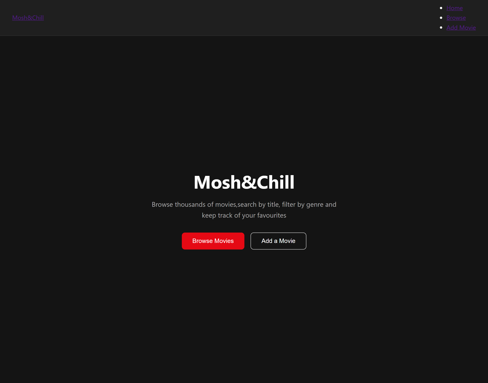
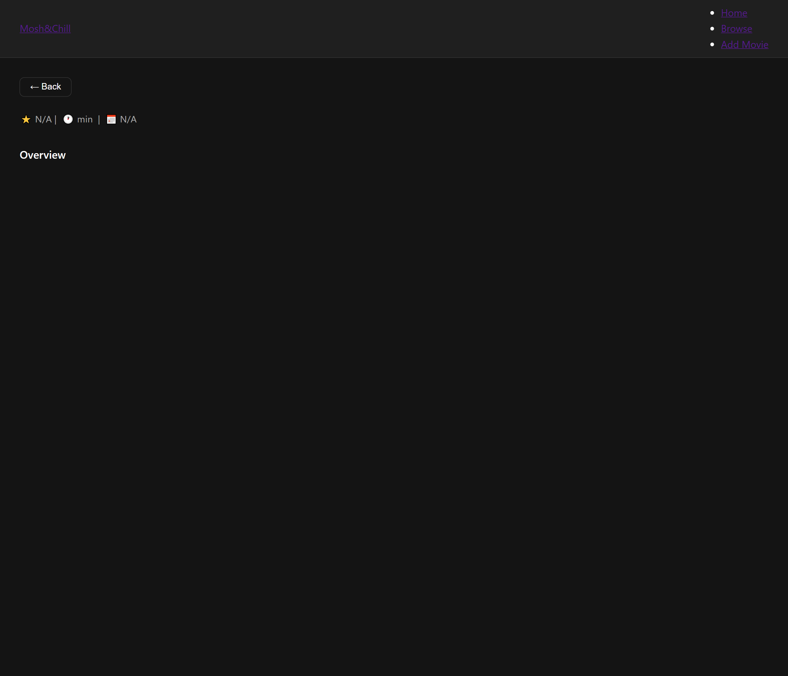
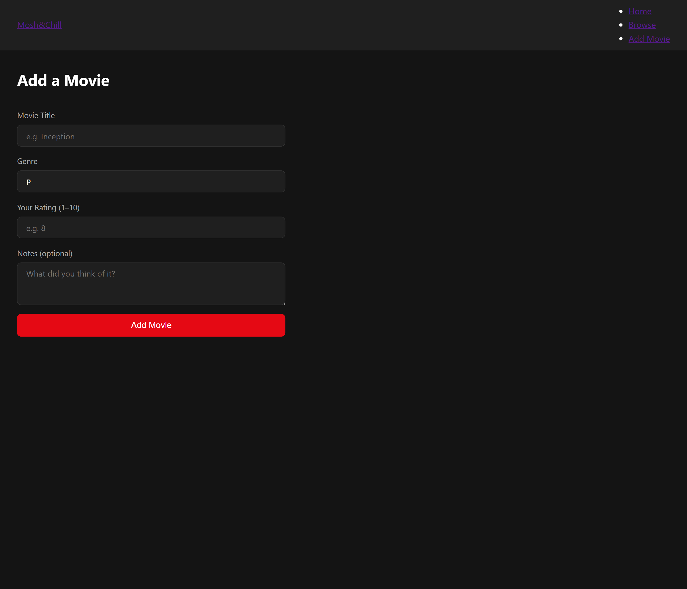

# 🎬 Mosh&Chill — Movie Explorer

Student Name: Hlelolwenkosi Mahlalela
Student Number: 24020091
INFS 202 — Frontend Development
Project: Midterm Individual Project

## Description

Mosh&Chill is a React web application that allows users to browse, search and filter movies using the TMDB (The Movie Database) public API. Users can view a grid of trending movies, search by title, filter by genre,
and click any movie to view its full details. Users can also add a movie to a personal list using the Add Movie form.

## Features

- Browse trending movies on page load
- Search movies by title
- Filter movies by genre
- View full movie details including backdrop, rating, runtime and overview
- Add a movie using a validated form with controlled inputs
- Responsive layout for desktop, tablet and mobile
- User registration and login with JWT authentication

## Technologies Used

- React via Vite
- React Router DOM
- TMDB API
- CSS
- JavaScript custom hooks
- Node.js
- Express
- PostgreSQL
- JWT Authentication
- bcryptjs
- CORS
- Deployed on Vercel and Render

## Project Structure

Hlelo-s_movie-explorer/
├── backend/
│ ├── config/
│ │ ├── db.js
│ │ └── db.sql
│ ├── controllers/
│ │ ├── authController.js
│ │ └── movieController.js
│ ├── middleware/
│ │ └── authMiddleware.js
│ ├── routes/
│ │ ├── authRoutes.js
│ │ └── movieRoutes.js
│ ├── .env
│ ├── package.json
│ └── server.js
├── src/
│ ├── components/
│ │ ├── Navbar.jsx
│ │ └── MovieCard.jsx
│ ├── pages/
│ │ ├── Home.jsx
│ │ ├── List.jsx
│ │ ├── Details.jsx
│ │ ├── AddItem.jsx
│ │ ├── Login.jsx
│ │ └── Register.jsx
│ ├── services/
│ │ ├── api.js
│ │ └── authApi.js
│ ├── styles/
│ │ ├── base.css
│ │ ├── navbar.css
│ │ ├── home.css
│ │ ├── cards.css
│ │ ├── list.css
│ │ ├── details.css
│ │ ├── forms.css
│ │ └── auth.css
│ ├── js/
│ │ ├── useMovies.js
│ │ ├── useGenres.js
│ │ └── utils.js
│ ├── App.jsx
│ └── main.jsx
├── vercel.json
└── README.md

## How to Run the Project

### 1. Clone the repository

git clone https://github.com/HleloMahlalela/Hlelo-s_movie-explorer.git

cd Hlelo-s_movie-explorer

### 2. Install frontend dependencies

npm install

## 3. Set up TMDB API key

Create a file called `.env` in the root of the project and add:

VITE_TMDB_KEY=63de1954f65aeb2a4db81f8ddec07adc

Get a free API key at: https://www.themoviedb.org/settings/api

### 4. Start the frontend

npm run dev

Open your browser and go to:
https://hlelo-s-movie-explorer.vercel.app

### 5. Install backend dependencies

cd backend
npm install

### 6. Set up backend environment

Create a `.env` file inside the `backend` folder and add:

PORT=5000
DB_HOST=your_db_host
DB_PORT=5432
DB_NAME=mosh_chill
DB_USER=your_db_user
DB_PASSWORD=password123
JWT_SECRET=your_jwt_secret
JWT_EXPIRES_IN=7d

### 7. Start the backend

npm run dev

## Required Routes

| Route | Page |

| `/home` | Home page |
| `/list` | Browse movies |
| `/details/:id` | Movie detail page |
| `/add` | Add a movie form |

## Screenshots

| Page | Screenshot |

| Home |  |
| Browse |  |
| Details |  |
| Add Movie |  |

## API Endpoints

### Auth

| Method | Endpoint | Description |

| POST | /api/auth/register | Register a new user |
| POST | /api/auth/login | Login and get JWT token |

### Movies

| Method | Endpoint | Description |

| GET | /api/movies | Get all movies for logged in user |
| GET | /api/movies/:id | Get a single movie |
| POST | /api/movies | Add a new movie |
| PUT | /api/movies/:id | Update a movie |
| DELETE | /api/movies/:id | Delete a movie |
